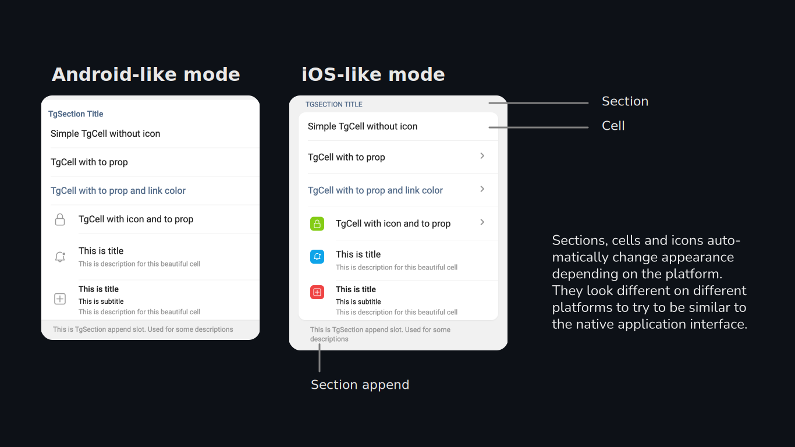
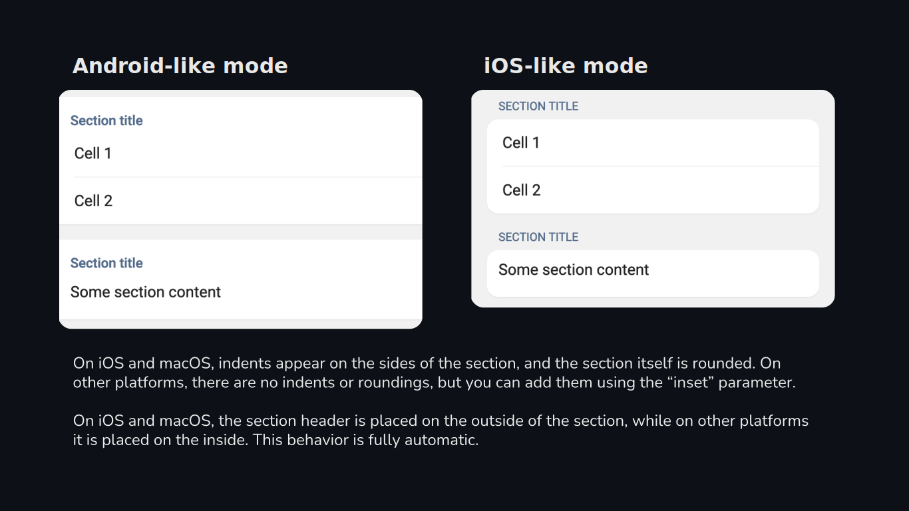

# Nuxt Telegram Miniapps UI Kit

This is an experiment in building a library of Telegram web application interface components with Tailwind CSS. All components inherit the design concept of Telegram for Android and partially Telegram for iOS, but do not try to match it exactly.

⚠️ **Please do not use this library in real projects until the first stable version is published. Breaking changes may occur without prior notice!**

## Installation

```bash
npm install -D nuxt-telegram-webapps
```
> **Note**: This also installs required nuxt modules:
>
> - [@nuxtjs/tailwindcss](https://github.com/nuxt-modules/tailwindcss)
> - [@nuxtjs/google-fonts](https://github.com/nuxt-modules/google-fonts)
> - [nuxt-icon](https://github.com/nuxt-modules/icon)
> - [@vueuse/nuxt](https://github.com/vueuse/vueuse/tree/main/packages/nuxt)

## Usage

This component library is [Nuxt Layer](https://nuxt.com/docs/getting-started/layers). To use it, just add the `extends` setting.

```ts
// nuxt.config.ts
export default defineNuxtConfig({
  extends: [
    'nuxt-telegram-miniapps',
  ]
})
```

Then create a page that is supposed to be a web application or place the web application components in the `app.vue`. It's recommended to place all components inside helper component `TgContent`.

```html
<template>
  <TgContent>
    <TgSection>
      <TgCell title="Some title" />
    </TgSection>
  </TgContent>
</template>
```

## Components



### TgSection
A component within which you can place TgCell`s groups or any content block of a web application

#### Props
| Name | Type | Description |
| ---- | ---- | ----------- |
| title | string | The panel title |
| content | boolean | Adds paddings inside section, use if no cells inside |
| inset | boolean | Adds margins around the section (automatically on iOS and macOS) |

```html
<!-- Section with cells -->
<TgSection title="Section title">
  <TgCell title="Cell 1" />
  <TgCell title="Cell 2" />
</TgSection>

<!-- Section with content -->
<TgSection title="Section title" content>
  <p>Some section content</p>
</TgSection>
```



### TgCell
This is the main component of the menu. It automatically sets paddings, icon positioning, colors and dividers.

#### Props
| Name | Type | Description |
| ---- | ---- | ----------- |
| title | string | Main text of the cell |
| description | string | Faded small text or hint |
| subtitle | string | Not faded small text, positioned before description |
| icon | string | Name of the icon (look: https://icones.js.org/) |
| line-clamp | string | Line clamp of the subtitle and description |
| color | string | Can be `default`, `link`, `danger` |
| icon-color | string | Name of the color from those in the [Tailwind](https://tailwindcss.com/docs/customizing-colors) set, or any CSS value |
| border | boolean | Determines whether to show the border at the bottom |

If the icon option is used, the icon will be displayed differently depending on the platform. On iOS and macOS the icon will be placed inside a colored square (don't forget to set `icon-color`), while on other platforms it will be displayed without a square and will inherit the system hint color.

If you want to control the display of the icon yourself, use the `prepend` slot and the `TgIconBox` component.

#### Slots
| Name | Description |
| ---- | ----------- |
| default | You can add any content you want to the cell |
| icon | Places the content to the left of the main content, usually there is an icon there |
| right | Places the content to the right of the main content |

```html
<!-- Simple cell -->
<TgCell title="Some title" description="Some description" />

<!-- Cell with content -->
<TgCell>
  <p>Some content inside the cell</p>
</TgCell>

<!-- Cell with slots -->
<TgCell title="Some title" description="Some description">
  <template #icon>
    <TgIconBox icon="material-symbols:qr-code" />
  </template>
  <template #right>
    <TgButton size="sm">Button</TgButton>
  </template>
</TgCell>
```

### TgButton
This is just button, not something special 💁‍♂️
It is used to trigger some actions

#### Props
| Name | Type | Description |
| ---- | ---- | ----------- |
| color | string | May be `primary` or `danger` |
| type | string | May be `button`, `submit` or `reset` |
| to | string | Vue-Router route location |
| href | string | External link |
| disabled | boolean | Disabled state |
| rel | string | Rel attribute |
| target | string | Target attribute |
| size | string | May be `sm`, `md`, `lg` or `xl` |
| text | boolean | Set `true` if you want to make button look like link |
| icon | string | The name of the icon (look: https://icones.js.org/) |

### TgIconBox
A component to display an icon inside a circle or rectangle with rounded corners. The icon can be replaced by text

#### Props
| Name | Type | Description |
| ---- | ---- | ----------- |
| icon | string | The name of the icon (look: https://icones.js.org/) |
| text | string | Text to display instead of an icon |
| round | boolean | Display a circle or rectangle box |
| size | string | May be `sm`, `md`, `lg` or `xl` |
| color | string | Name of the color from those in the [Tailwind](https://tailwindcss.com/docs/customizing-colors) set, or any CSS value |
| backgroundColor | string | Icon box (background) color |

You can place the `TgIconBox` in the `icon` slot of the `TgCell` component:
```html
<TgCell title="Some title" description="Some description">
  <template #icon>
    <TgIconBox icon="material-symbols:qr-code" />
  </template>
</TgCell>
```

### TgInput
Just input without borders

#### Props
| Name | Type | Description |
| ---- | ---- | ----------- |
| v-model:value | string | Input text |
| placeholder | string | Placeholder text |

```html
<TgSection title="Section title" content>
  <TgInput v-model:value="input" />
</TgSection>
```

### Platforms
If you want to test the appearance on different platforms, use the `usePlatform` compsable in the `app.vue` file or in the miniapp page by passing the 'ios' or 'android' parameter to it and reloading the page. This is for testing and debugging purposes and may change in the future.
